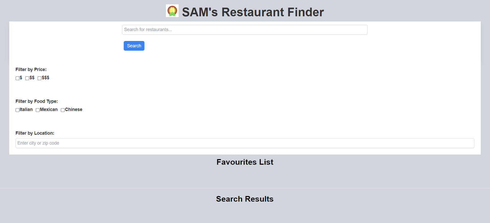

# SAM's Resturant Locator

[Project 1 for Sarah Naveed, Ariana Vinamagua, and Max Walent]

<a href='https://r3gal0.github.io/Project01/'>Go to Website here</a>

## Description

Before you can use the app you need to initate a proxy demo (<a href='https://cors-anywhere.herokuapp.com/'>proxy</a>). Visit the website and click on the demo button.

An app to show you restaurants in an area that match user provided criteria. TBD: A favourite function to save restaurants the user is interested in or like to eat at.

## Source

This was cloned from a repo I made during the University of Toronto boot camp as part of a team. It was cloned so I can modify it by myself without affecting the origional code.

<a href='https://github.com/R3GAL0/Project01'>Origional Repo</a>